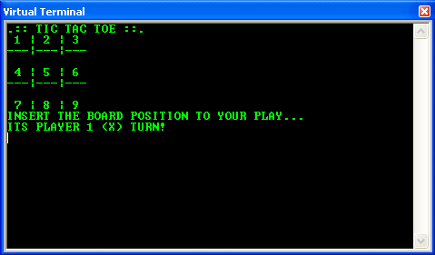

# tictactoe8086plus

  

 

## First things first
You must have [Proteus Design Suite](https://www.labcenter.com/) installed and make sure you have `MASM32` compiler plugin installed.

## This code is weird
This is a *plus* version of **`tictactoe8086`**, so I've already warned you about the messy code.

## Running it
You don't even need to understand assembly. Just open **`tictactoe8086plus`** Proteus executable and click in that nice button called "play". A terminal should pop up and that's it!

## License
Released under the [GPLv3](LICENSE) license.
